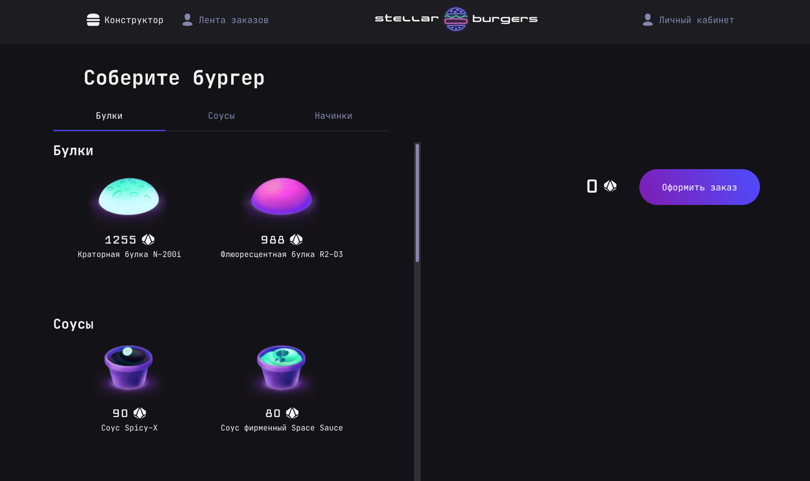
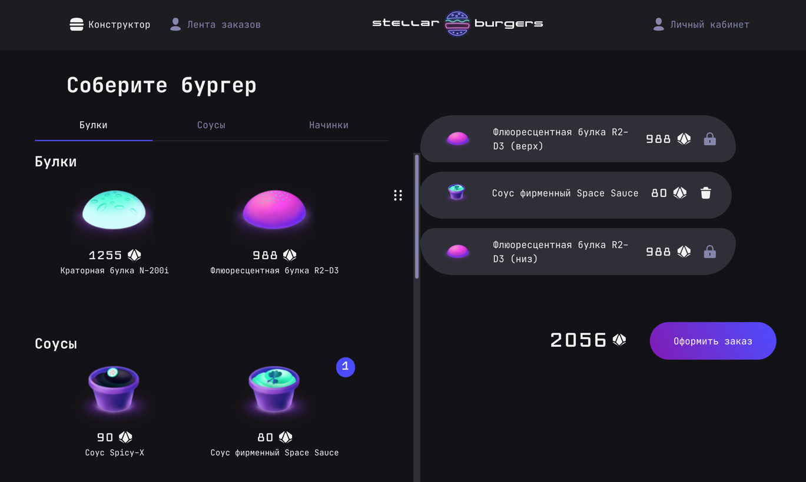
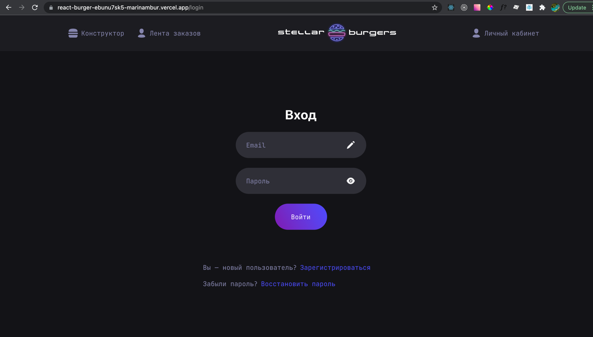
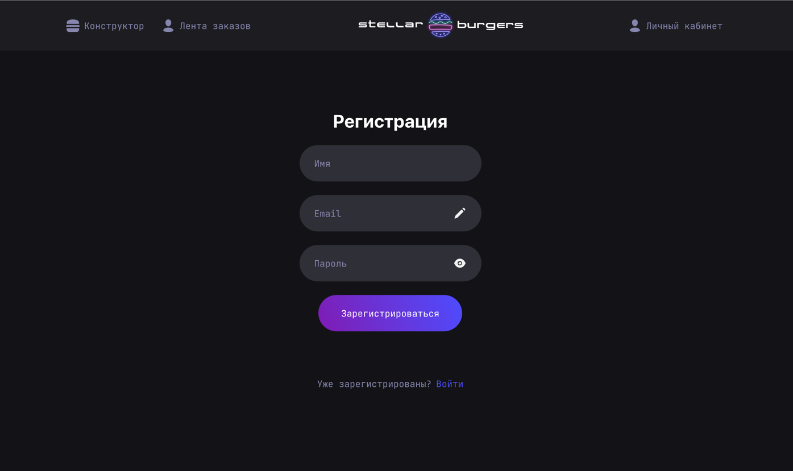
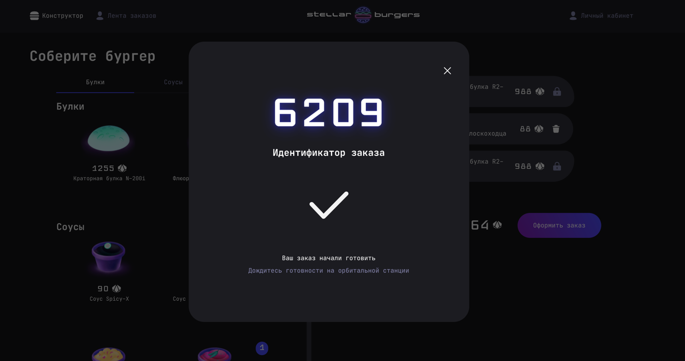
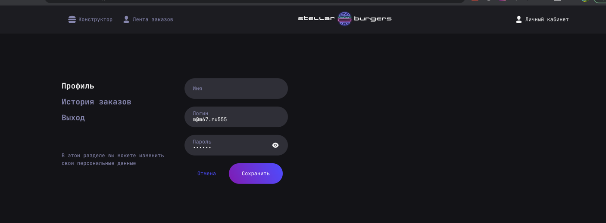
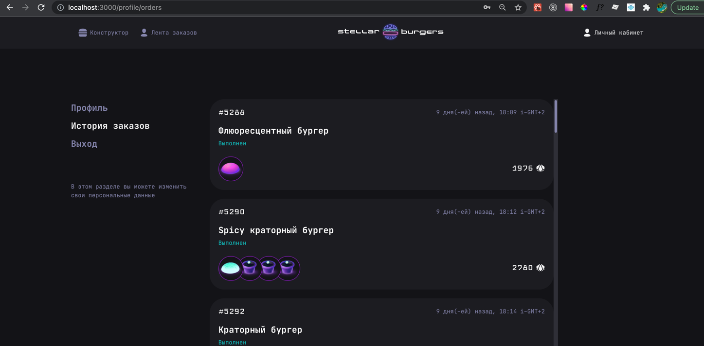
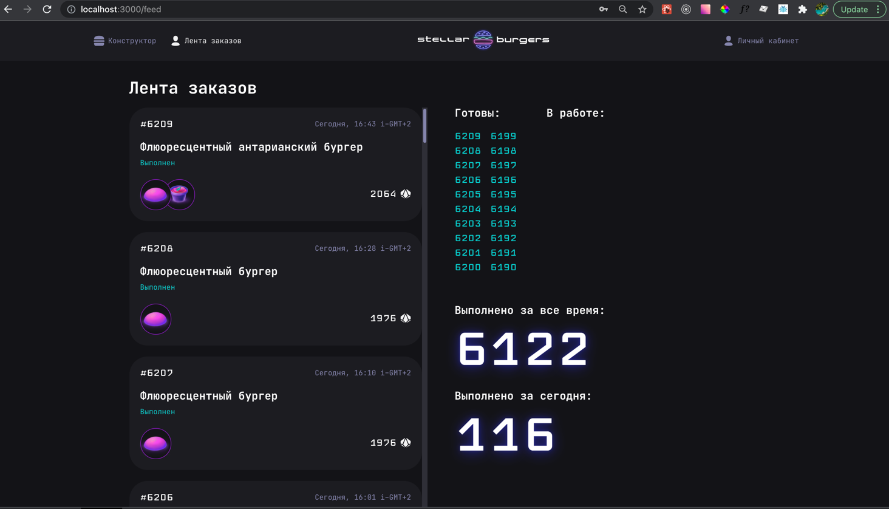

**BurgerShop** - космическая бургерная!Здесь можно заказать бургер своей мечты и посмотреть что едят другие :)
Проект можно посмотреть здесь https://react-burger-git-sprint-6-step-1-marinambur.vercel.app или локально, запустив  **yarn install, yarn start**
#Используемы технологии 
React, Redux, WebSockets, DND-library, Cypress-тесты, Jest-тесты
- **Домашняя страница**

- **Делаем заказ** : для этого перетаскиваем элемент начинки или булки вправо (к кнопке оформить заказ)
После того, как добавили все что понравилось - оформляем заказ. Необходимо добавить булку, без булки нет бургера !

- **Регистрируемся в приложении**: так как оформление заказа только для авторизованных пользователей, вы будете перекинуты на страницу логина. Если вы здесь впервые - нажмите кнопку Зарегистрироваться 

- **Продолжаем оформление заказа**: после регистрации и успешного входа в приложение, вы вернетесь на страницу заказа. Теперь можно продолжить оформление. После нажатия на кнопку Оформить заказ ждем 15 секунд, затем видим окно с деталями и номером заказа:

- **Смотрим свои заказы в личном кабинете**, также там можно поменять имя и пароль, а также выйти из приложения (разлогиниться)

- **Смотрим заказы всех пользователей**: заказы обновляются в реальном времени, на вкладке Лента заказов можно за всеми наблюдать

